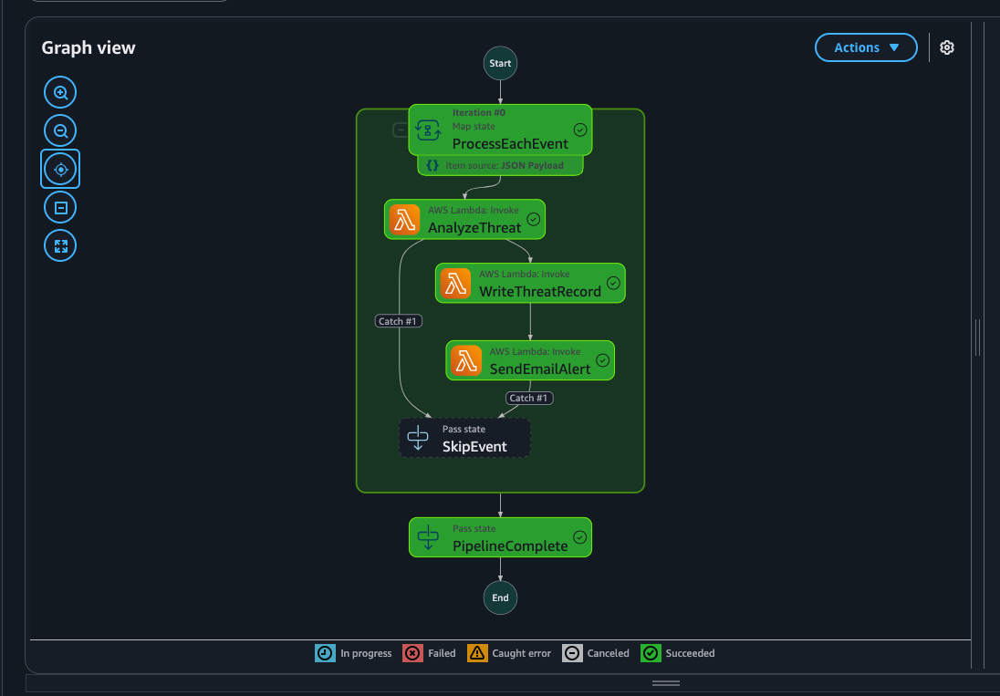
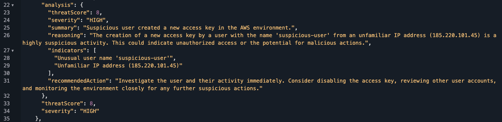
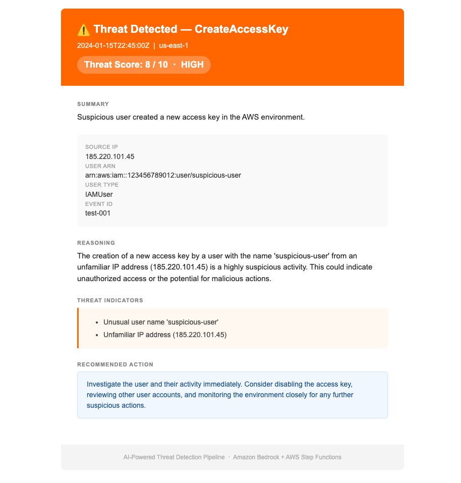
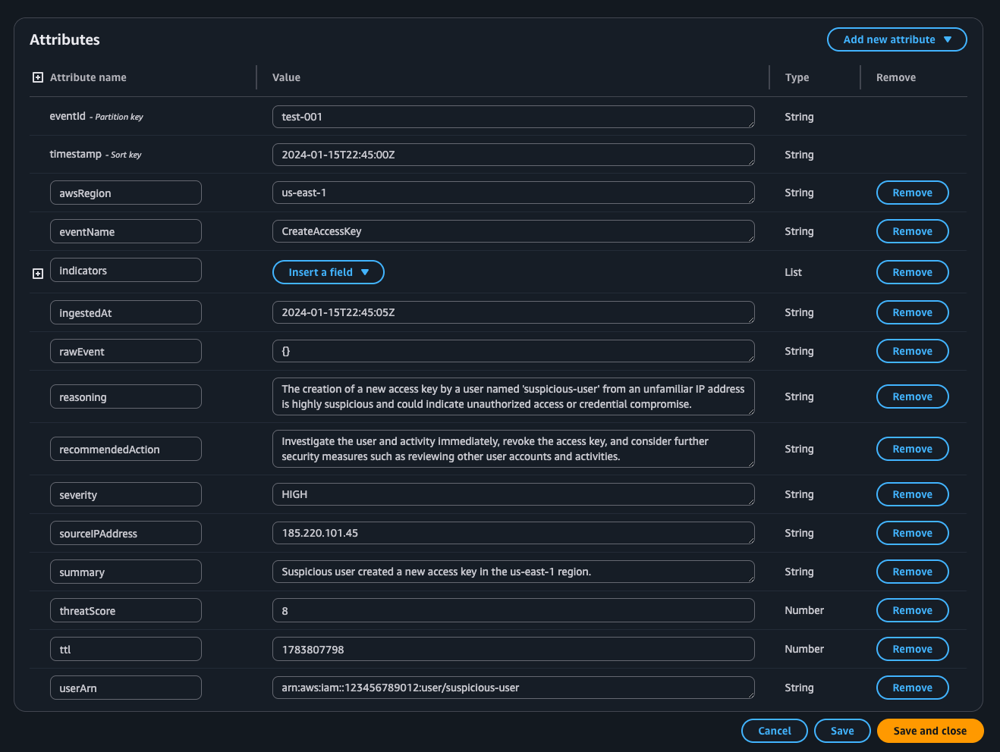
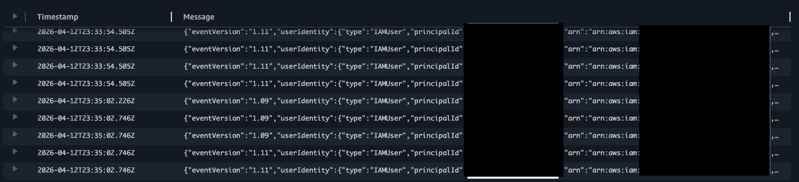
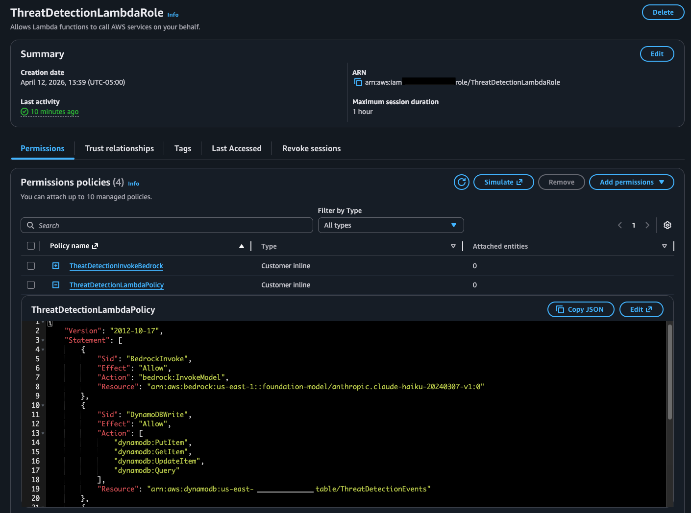

# 🛡️ AI-Powered Cloud Threat Detection Pipeline

> Real-time AWS security event analysis powered by Amazon Bedrock (Claude AI), Step Functions, and Lambda — automatically detecting, scoring, and alerting on suspicious cloud activity.



---

## 🚀 Overview

This project is a fully serverless, event-driven threat detection pipeline built on AWS. It ingests CloudTrail API logs in real time, filters for high-risk security events, runs each event through an AI analysis engine powered by **Amazon Bedrock (Claude Haiku)**, persists structured threat records to DynamoDB, and delivers formatted HTML alert emails via SES — all orchestrated by Step Functions.

> ✅ **Initially built and validated through the AWS Console.** Currently being re-implemented as **Infrastructure as Code using Terraform** for production-readiness and repeatable deployments.

---

## 🏗️ Architecture

```
CloudTrail → CloudWatch Logs → Lambda Trigger
                                      ↓
                           Step Functions Orchestrator
                           ├── AnalyzeThreat      (Bedrock/Claude Haiku)
                           ├── WriteThreatRecord  (DynamoDB)
                           └── SendEmailAlert     (SES)
                                      ↓
                        DynamoDB (Threat Records) + SES (HTML Alerts)
```

### Services Used

| Service | Role |
|---|---|
| **AWS CloudTrail** | Source of truth — records every API call in the account |
| **CloudWatch Logs** | Real-time log ingestion and Lambda trigger |
| **AWS Lambda** | Enrichment, AI analysis, persistence, and alerting |
| **Amazon Bedrock** | Claude Haiku model for AI-powered threat scoring |
| **AWS Step Functions** | Workflow orchestration with error handling |
| **Amazon DynamoDB** | Threat record persistence with TTL |
| **Amazon SES** | HTML-formatted threat alert emails |
| **Amazon S3** | CloudTrail log archival |
| **AWS IAM** | Least-privilege roles per service |

---

## ⚙️ How It Works

1. **CloudTrail** captures every API call made in the AWS account and streams it to **CloudWatch Logs**
2. A **CloudWatch Logs subscription filter** triggers the enrichment Lambda on every new log batch
3. The Lambda decodes, decompresses, and filters events — only high-risk event types (e.g. `DeleteTrail`, `CreateAccessKey`, `AttachUserPolicy`) proceed
4. **Step Functions** orchestrates the remaining pipeline in parallel across all qualifying events
5. The **Bedrock Lambda** sends each enriched event to Claude Haiku with a structured security analysis prompt, returning a threat score (1–10), severity rating, reasoning, indicators, and recommended action
6. The **DynamoDB Lambda** persists the full threat record with a 90-day TTL
7. For scores ≥ 7, the **SES Lambda** sends a formatted HTML alert email with color-coded severity, threat indicators, and recommended action

---

## 📸 Pipeline in Action

### Step Functions — Successful Execution
All pipeline states completing successfully with the Map state processing events in parallel.


---

### Amazon Bedrock — AI Threat Analysis Output
Claude Haiku returning a structured threat assessment with score, severity, reasoning, and indicators.



---

### SES Alert Email — HTML Formatted
Formatted threat alert email delivered via SES showing severity badge, metadata grid, indicators, and recommended action.



---

### DynamoDB — Threat Record
Persisted threat record showing all analyzed fields including `threatScore`, `severity`, `reasoning`, `recommendedAction`, and `ttl`.



---

### CloudWatch Logs — Live CloudTrail Stream
Real-time CloudTrail events flowing into CloudWatch Logs, forming the event-driven data source for the pipeline.



---

### IAM — Least-Privilege Role
`ThreatDetectionLambdaRole` with scoped inline policies granting only the specific actions and resource ARNs each service requires.



---

## 🔍 Detected Event Types

The pipeline monitors for the following high-risk CloudTrail events:

| Category | Events |
|---|---|
| **Credential Access** | `CreateAccessKey`, `GetSecretValue` |
| **Persistence** | `CreateUser`, `AttachUserPolicy`, `PutUserPolicy` |
| **Defense Evasion** | `DeleteTrail`, `StopLogging` |
| **Destruction** | `DeleteUser`, `DeleteBucket`, `DeleteSecret` |
| **Privilege Escalation** | `AssumeRoleWithWebIdentity` |
| **Infrastructure** | `AuthorizeSecurityGroupIngress`, `CreateVpc`, `RunInstances` |
| **Initial Access** | `ConsoleLogin` |

---

## 🧠 AI Threat Scoring

Each event is analyzed by Claude Haiku using a structured security prompt. The model returns:

```json
{
  "threatScore": 8,
  "severity": "HIGH",
  "summary": "Suspicious user created a new access key in the AWS environment.",
  "reasoning": "The creation of a new access key by a user with the name 'suspicious-user' from an unfamiliar IP address (185.220.101.45) is highly suspicious activity...",
  "indicators": [
    "Unusual user name 'suspicious-user'",
    "Unfamiliar IP address (185.220.101.45)"
  ],
  "recommendedAction": "Investigate the user and their activity immediately. Consider disabling the access key..."
}
```

**Scoring Guide:**

| Score | Severity | Meaning |
|---|---|---|
| 1–3 | LOW | Normal operations, expected behavior |
| 4–6 | MEDIUM | Unusual but potentially legitimate |
| 7–8 | HIGH | Highly suspicious, likely malicious |
| 9–10 | CRITICAL | Immediate action required |

---

## 🗂️ Project Structure

```
aws-threat-detection-pipeline/
├── lambda/
│   ├── threat_log_enricher/
│   │   └── lambda_function.py
│   ├── threat_bedrock_analyzer/
│   │   └── lambda_function.py
│   ├── threat_record_writer/
│   │   └── lambda_function.py
│   └── threat_email_alerter/
│       └── lambda_function.py
├── step_functions/
│   └── threat_detection_pipeline.json
├── iam/
│   ├── lambda_role_policy.json
│   └── stepfunctions_role_policy.json
├── terraform/           ← In Progress
│   ├── main.tf
│   ├── lambda.tf
│   ├── iam.tf
│   ├── dynamodb.tf
│   ├── step_functions.tf
│   └── variables.tf
├── images/
│   ├── stepfunctions-execution-graph.png
│   ├── bedrock-analysis-output.png
│   ├── ses-email-alert.png
│   ├── dynamodb-threat-record.png
│   ├── cloudwatch-logs-stream.png
│   └── iam-role-policy.png
└── README.md
```

---

## 🚧 Infrastructure as Code (In Progress)

This project was initially built and validated through the **AWS Console** to understand each service's configuration requirements. It is currently being re-implemented using **Terraform** to enable:

- Repeatable, version-controlled deployments
- Environment parity (dev / staging / prod)
- Automated IAM role and policy provisioning
- CI/CD pipeline integration

---

## 🔮 Planned Enhancements

- **IP Reputation Enrichment** — Pre-analysis enrichment via AbuseIPDB or GreyNoise API
- **MITRE ATT&CK Mapping** — Classify each threat to a specific tactic and technique
- **Automated Remediation** — Step Functions branch to auto-revoke keys or block IPs on CRITICAL events
- **Threat Dashboard** — QuickSight or React-based dashboard for trend visualization
- **Multi-Account Coverage** — AWS Organizations integration for account-wide detection
- **Bedrock Knowledge Base** — Ground AI analysis in org-specific runbooks and known-good baselines
- **Slack / Teams Alerting** — Interactive alert messages with Acknowledge / Escalate buttons

---

## 🛠️ Built With

- [Amazon Bedrock](https://aws.amazon.com/bedrock/) — Claude Haiku (Anthropic)
- [AWS Step Functions](https://aws.amazon.com/step-functions/)
- [AWS Lambda](https://aws.amazon.com/lambda/) — Python 3.12
- [Amazon DynamoDB](https://aws.amazon.com/dynamodb/)
- [Amazon SES](https://aws.amazon.com/ses/)
- [AWS CloudTrail](https://aws.amazon.com/cloudtrail/)
- [Terraform](https://www.terraform.io/) *(in progress)*
