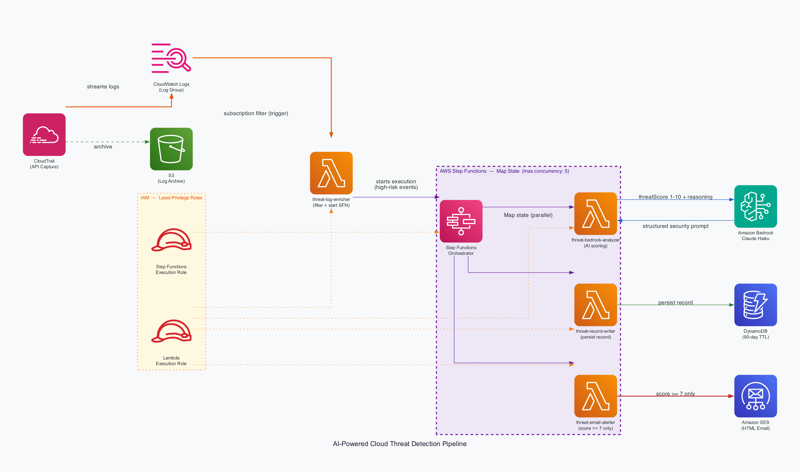

# AI-Powered Cloud Threat Detection Pipeline

A fully serverless pipeline that watches high-risk AWS API activity from CloudTrail, scores each event with an LLM, stores structured findings, and sends color-coded email alerts—with optional automated remediation on critical scores.


## Architecture

Data flows from log delivery through a subscription filter into an enricher Lambda, then Step Functions fan out analysis per event. Critical scores can invoke remediation before persistence and alerting.

```
CloudTrail (management events)
        │
        ├──▶ S3 (log archive)
        │
        ▼
CloudWatch Logs (delivery log group)
        │
        ▼ (subscription filter: high-risk eventName)
threat-log-enricher (Lambda)
        │
        ▼
Step Functions (Map, max concurrency 5)
        │
        ├──▶ threat-bedrock-analyzer ──▶ Amazon Bedrock (Claude Haiku)
        │
        ├──▶ (score ≥ 9) threat-remediator ──▶ remediation actions
        │
        ├──▶ threat-record-writer ──▶ DynamoDB (TTL)
        │
        └──▶ threat-email-alerter ──▶ Amazon SES (HTML alerts)
```



## How it works

1. **CloudTrail** records management API activity and delivers logs to **S3** (archive) and to a **CloudWatch Logs** log group.
2. A **CloudWatch Logs subscription filter** invokes **threat-log-enricher** on incoming log batches, matching a fixed set of high-risk `eventName` values.
3. The enricher decodes and normalizes events, then starts the **ThreatDetectionPipeline** Step Functions execution with the batch (`eventsToAnalyze`).
4. A **Map** state processes each event with **threat-bedrock-analyzer**, which calls **Amazon Bedrock** (Claude Haiku) and returns a structured score, severity, reasoning, indicators, and recommended action.
5. A **Choice** state branches on score: **≥ 9** runs **threat-remediator** (with retry and catch-to-continue), then **threat-record-writer** and a **critical** email path; **≥ 7** (and below 9) goes straight to **threat-record-writer** and then an email if the score still meets the alert threshold; lower scores are written without email.
6. **threat-record-writer** persists the full record in **DynamoDB** with a time-to-live for automatic expiry.
7. **threat-email-alerter** sends HTML email via **SES** for alert-worthy outcomes (standard high-severity path vs. critical path depending on the branch).
8. **IAM** grants least-privilege roles to Lambdas and Step Functions; **VPC** and a **security group** support remediation-related configuration passed to workers.

### High-risk events monitored

The subscription filter is aligned with these CloudTrail event names (see `terraform/lambda.tf` for the authoritative list):

| Category | Events |
|---|---|
| **Authentication** | `ConsoleLogin` |
| **Identity & IAM** | `CreateUser`, `DeleteUser`, `AttachUserPolicy`, `PutUserPolicy`, `CreateAccessKey` |
| **Defense evasion** | `DeleteTrail`, `StopLogging` |
| **Data & storage** | `DeleteBucket`, `PutBucketPolicy` |
| **Network & compute** | `AuthorizeSecurityGroupIngress`, `CreateVpc`, `RunInstances` |
| **Privilege & secrets** | `AssumeRoleWithWebIdentity`, `GetSecretValue`, `DeleteSecret` |

### AI output shape

Each analyzed event yields JSON similar to:

```json
{
  "threatScore": 8,
  "severity": "HIGH",
  "summary": "Suspicious user created a new access key in the AWS environment.",
  "reasoning": "The creation of a new access key by a user with the name 'suspicious-user' from an unfamiliar IP address (185.220.101.45) is highly suspicious activity...",
  "indicators": [
    "Unusual user name 'suspicious-user'",
    "Unfamiliar IP address (185.220.101.45)"
  ],
  "recommendedAction": "Investigate the user and their activity immediately. Consider disabling the access key..."
}
```

| Score | Severity | Meaning |
|---|---|---|
| 1–3 | LOW | Normal operations, expected behavior |
| 4–6 | MEDIUM | Unusual but potentially legitimate |
| 7–8 | HIGH | Highly suspicious, likely malicious |
| 9–10 | CRITICAL | Immediate action required |

## Key design decisions

### 1. Step Functions Map for per-event concurrency

Fan-out with **Map** (`MaxConcurrency = 5`) isolates failures per event, keeps Bedrock calls bounded, and avoids a single oversized Lambda handling unbounded batches. The tradeoff is more state transitions and cost at very high volume versus one monolithic worker.

### 2. Subscription filter + explicit event allow list

Matching on `eventName` in CloudWatch Logs avoids running the pipeline on every API call in the account. The tradeoff is maintenance: new tactics require updating the pattern, but cost and noise stay low compared to scoring everything with an LLM.

### 3. DynamoDB with TTL for threat records

Structured rows land in **DynamoDB** with TTL for automatic expiry (for example ~90 days). This favors serverless ops and predictable storage over a data warehouse or OpenSearch for this demo scope.

### 4. Branching remediation only at critical scores

Scores **≥ 9** invoke **threat-remediator** with **Catch** routing back to the write path if remediation fails—so analysis and auditing still complete. Lower scores skip automated action to limit blast radius.

### 5. Terraform as the source of truth

The project was first validated in the console; **Terraform** now owns VPC, CloudTrail delivery, Lambdas, Step Functions, DynamoDB, SES wiring, and IAM so the stack is repeatable and reviewable in PRs.

## AWS services used

- **CloudTrail** — captures management API activity used as the security signal.
- **S3** — durable archive for CloudTrail log files.
- **CloudWatch Logs** — real-time log destination and subscription filter source.
- **Lambda** — log enrichment, Bedrock invocation, DynamoDB writes, email delivery, and remediation tasks.
- **Step Functions** — orchestrates Map processing, choice branching, retries, and error handling.
- **Amazon Bedrock** — Claude Haiku for structured threat scoring and narrative context.
- **DynamoDB** — persistence for enriched and scored threat records with TTL.
- **SES** — sends HTML alert messages to operators.
- **IAM** — least-privilege execution roles for Lambda and Step Functions.
- **VPC** — network container used with security groups for remediation-related resources.

## Prerequisites

### Required tools

- **AWS CLI** v2.x — [Installation guide](https://docs.aws.amazon.com/cli/latest/userguide/getting-started-install.html)
- **Terraform** >= 1.0 (see `terraform/versions.tf`) — [Installation guide](https://developer.hashicorp.com/terraform/downloads)
- **Python** 3.12+ (matches Lambda runtime)

### AWS account requirements

- Configured credentials (`aws configure` or equivalent) for **us-east-1** (this repo assumes that region).
- IAM ability to create and update: Lambda, Step Functions, DynamoDB, S3, CloudTrail, CloudWatch Logs, SES identities, IAM roles/policies, VPC resources used by the stack.
- **Amazon Bedrock**: enable model access for **Anthropic Claude Haiku** (or the model ID your analyzer uses) in the Bedrock console for the account/region.
- **SES**: verify the sender identity (and note SES sandbox limits for recipients if applicable).

### External requirements

- Verified **SES** email identity matching `ses_identity_email` in Terraform variables.
- Do not commit secrets: use `terraform/terraform.tfvars` locally (ignored); start from `terraform/terraform.tfvars.example`.

## Setup and deployment

### 1. Clone the repository

```bash
git clone https://github.com/Baricodes/AWS-Threat-Detection-Pipeline.git
cd AWS-Threat-Detection-Pipeline
```

### 2. Configure variables

```bash
cp terraform/terraform.tfvars.example terraform/terraform.tfvars
# Edit terraform.tfvars with your AWS account ID and SES emails
```

### 3. Deploy infrastructure

```bash
cd terraform
terraform init
terraform plan
terraform apply
```

### 4. Post-deploy checks

- Complete **SES** identity verification for the sender address in the SES console.
- Confirm **Bedrock** model access in **us-east-1**.
- Run a controlled test event (or use a non-production account) and inspect the Step Functions execution graph and CloudWatch logs for each Lambda.

### Terraform variables

| Variable | Description | Default |
|---|---|---|
| `aws_region` | AWS region for resources | `us-east-1` |
| `aws_account_id` | Account ID used in ARNs and policies | Required |
| `ses_identity_email` | Address to verify in SES (sender identity) | Required |
| `ses_alert_to_email` | Alert recipient; empty string falls back to `ses_identity_email` | `""` |

> **Console-only steps:** SES verification link, Bedrock model access, and any organizational SCP exceptions are still done in the AWS console.

## Screenshots

### Step Functions — successful execution

End-to-end run with Map state processing and branch logic visible in the graph.


### Amazon Bedrock — structured analysis output

Model output showing score, severity, and indicators used downstream.


### SES — HTML threat alert

Operator-facing email with severity styling and recommended action.


### DynamoDB — persisted threat record

Stored attributes including score, reasoning, and TTL.


### CloudWatch Logs — CloudTrail stream

Live delivery into the log group that feeds the subscription filter.


### IAM — least-privilege role

Scoped policies for Lambda/Step Functions execution.


## Troubleshooting

### Email sends fail or never arrive (`MessageRejected`, bounce, or no mail)

**Root cause:** SES is still in the **sandbox**, the identity is not verified, or the recipient is not allowed in sandbox mode.  
**Fix:** Verify the sender in SES, confirm `ses_alert_to_email` (or the fallback) is authorized for sandbox, or request production access. Check Lambda and SES metrics for rejections.

### `AccessDeniedException` when invoking Bedrock from `threat-bedrock-analyzer`

**Root cause:** Model access not enabled for Claude Haiku in **us-east-1**, or IAM denies `bedrock:InvokeModel`.  
**Fix:** In the Bedrock console, enable the model for the account. Confirm the Lambda role includes invoke permissions for the chosen model ARN/ID.

### Subscription filter never invokes the enricher

**Root cause:** CloudTrail delivery to the log group is misconfigured, the filter pattern does not match incoming events, or the Lambda resource policy does not allow `logs.amazonaws.com`.  
**Fix:** Confirm the trail delivers to the same log group Terraform manages, tail the log group for `eventName` traffic, and verify `aws_lambda_permission` for CloudWatch Logs in the plan/apply output.

## What I learned

- **Step Functions Choice ordering** matters: overlapping thresholds (for example ≥ 9 vs ≥ 7) must be ordered so critical paths run first; otherwise remediation never triggers.
- **CloudWatch Logs subscription filters** are inexpensive triggers but debugging them requires correlating filter syntax, gzip delivery format, and Lambda permissions—console “test” events do not replace end-to-end trail delivery.
- **SES sandbox constraints** dominate operator experience until production access: recipient allow lists are easy to forget when wiring `ses_alert_to_email`.
- **LLM outputs need a strict contract** (JSON shape and score bounds) so downstream Choice states and DynamoDB writes stay reliable; permissive prompts break automation silently.

## Future improvements

- **IP reputation enrichment** before Bedrock (AbuseIPDB / GreyNoise) for fewer false positives.
- **MITRE ATT&CK** tactic/technique labels on each record for reporting.
- **Richer remediation playbooks** with idempotency keys and manual approval for destructive actions.
- **CloudWatch alarms and dashboards** on Step Functions failures, Lambda errors, and SES bounce rate.
- **Multi-account ingestion** via Organizations or delegated CloudTrail patterns.

## Project structure

```
AWS-Threat-Detection-Pipeline/
├── images/                    # README screenshots and architecture diagram
├── terraform/
│   ├── lambda/                # Python handlers (enricher, analyzer, writer, alerter, remediator)
│   ├── *.tf                   # VPC, CloudTrail, CloudWatch, DynamoDB, Lambda, Step Functions, SES, etc.
│   ├── terraform.tfvars.example
│   └── versions.tf
└── README.md
```
